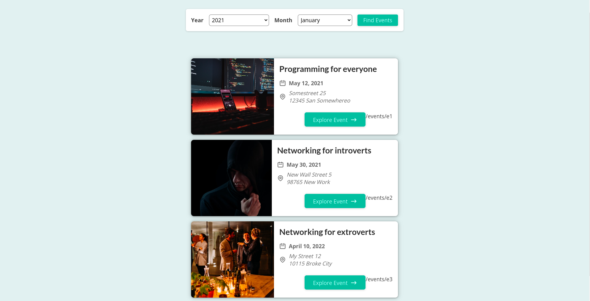

# events

This a events website

## Description
Events is a website that shows events where everyone can lean to program and programmers can come together network and share ideas

## Built With

- Nextjs
- CSS

## Getting Started
To get the content of this project locally you need to run this command in your terminal:
- git clone your https://github.com/matovu-farid/events.git
- cd project events
- npm install
- npm start
### Deployment
This project is deployed on a github page on the link below:
- [Click here](https://friendly-allen-b461f6.netlify.app/)

## Author

👤 **Matovu Farid Nkoba**

- GitHub: [@matovu-farid](https://github.com/matovu-farid)
- Twitter: [@matovu100](https://twitter.com/matovu100)
- LinkedIn: [matovu-farid](https://www.linkedin.com/in/matovu-farid-48b80257)

## 📝 License

This project is [MIT](./MIT.md) licensed.
